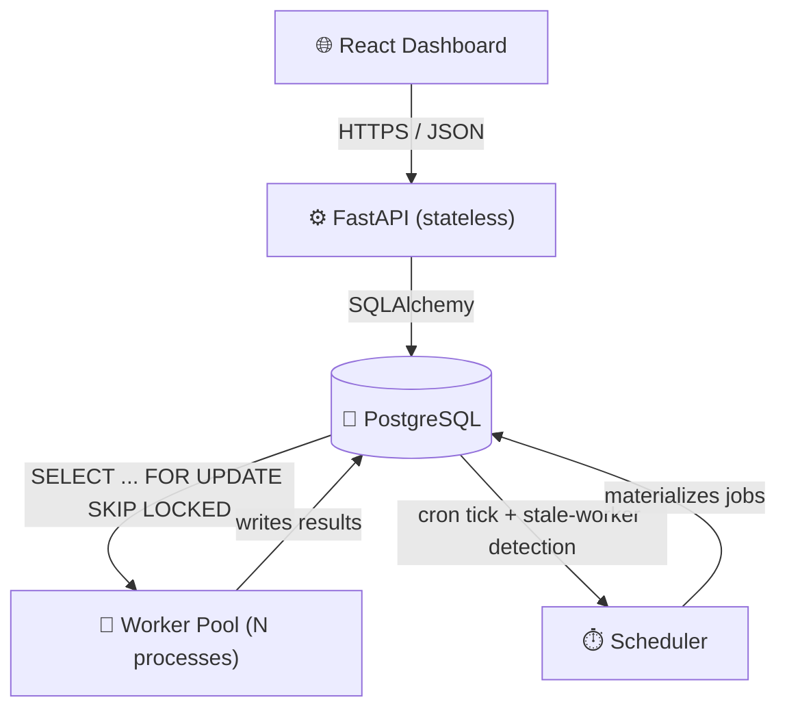
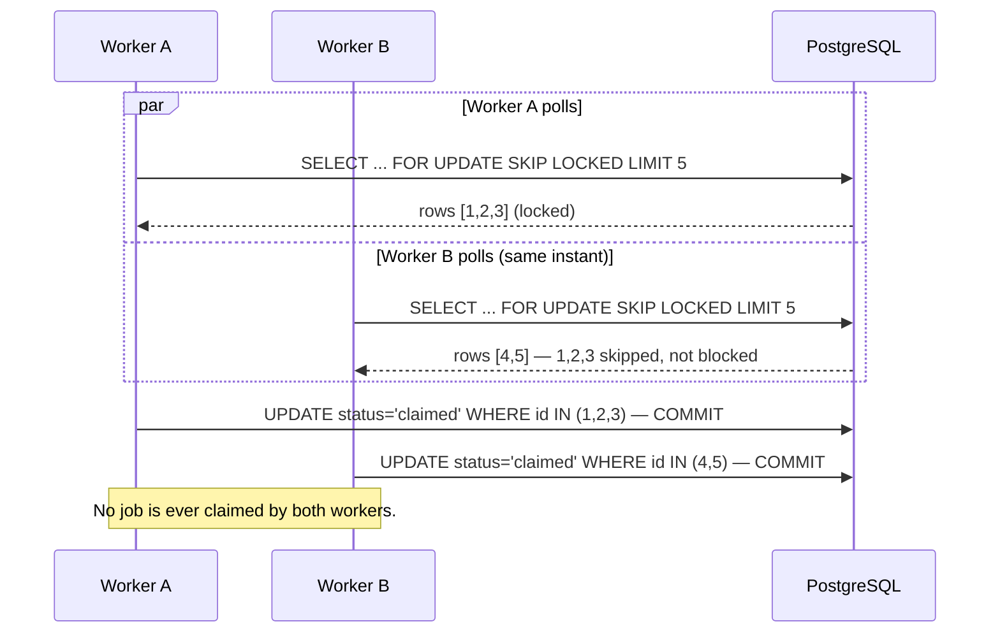
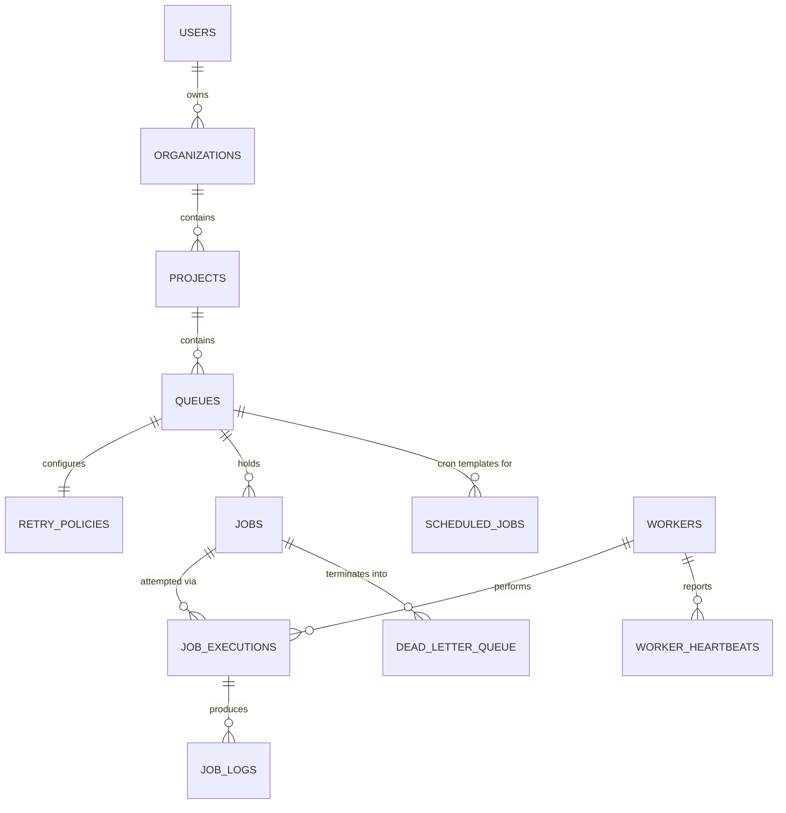

<div align="center">

# ⚡ Distributed Job Scheduler

### A production-inspired platform for reliably executing asynchronous background jobs across multiple workers

[](https://www.python.org/)
[](https://fastapi.tiangolo.com/)
[](https://www.postgresql.org/)
[](https://react.dev/)
[](https://www.typescriptlang.org/)
[](https://www.docker.com/)
[](LICENSE)

**Durable queues · Atomic job claiming · Configurable retries · Dead-letter recovery · Cron scheduling · Live dashboard**

[Features](#-features) • [Architecture](#-architecture) • [Quick Start](#-quick-start) • [Tech Stack](#-tech-stack) • [Database](#-database-design) • [API Docs](#-api-documentation) • [Testing](#-testing)

</div>

---

## 📖 Overview

Modern applications constantly need to do work outside the request/response cycle — sending emails, generating reports, processing images, syncing data. Doing that **reliably at scale**, across many workers, without ever losing a job or running it twice, is a genuinely hard distributed-systems problem.

This project is a real, working implementation of that system: a distributed job scheduler in the spirit of the internal infrastructure teams build at companies like **Stripe, Uber, and GitHub**. Built end-to-end — database design, backend API, background workers, a retry/failure-recovery engine, and a live monitoring dashboard — with a deliberate focus on **architecture and correctness over feature count**.

> 🎯 Built as an SDE internship capstone, evaluated on System Architecture, Database Design, Backend Engineering, Reliability & Concurrency, Frontend/UX, API Design, Documentation, and Testing.

---

## ✨ Features

<table>
<tr>
<td width="50%" valign="top">

### 🔐 Auth & Multi-tenancy
- JWT access + refresh tokens
- Bcrypt password hashing
- Organizations → Projects → Queues hierarchy
- Role-based access

### 📦 Flexible Job Types
- Immediate
- Delayed
- Scheduled
- Recurring (cron)
- Batch

### 🔁 Reliability Engine
- Fixed / linear / exponential backoff
- Configurable retry limits per queue
- Dead Letter Queue with one-click replay
- Idempotency keys for safe client retries

</td>
<td width="50%" valign="top">

### ⚙️ Concurrency-Safe Workers
- Atomic job claiming via `SELECT ... FOR UPDATE SKIP LOCKED`
- Zero-coordination horizontal scaling
- Heartbeats + automatic crash recovery
- Graceful shutdown (drains in-flight jobs)

### 📊 Live Dashboard
- Real-time queue, job & worker monitoring
- Throughput / failure-rate metrics
- Pause / resume queues
- Full execution & retry history

### 🧪 Production Hygiene
- Structured JSON logging + request IDs
- Centralized error handling
- Full test suite + CI pipeline
- One-command Docker deployment

</td>
</tr>
</table>

---

## 🏗 Architecture

Clean, layered architecture — each layer has one job and depends only on the layer beneath it.

```
API Routers  →  Services  →  Repositories  →  Models
 (HTTP only)   (business rules)  (all SQL)   (schema + pure logic)
```



**Why Postgres *as* the queue**, instead of a broker like SQS/RabbitMQ? One datastore to operate, transactional consistency between job state and domain data, and `SKIP LOCKED` gives genuine exactly-once-claim semantics with zero extra infrastructure. The claim query is isolated in the repository layer, so swapping in a broker later is a contained change, not a rewrite.

<details>
<summary><b>📋 Key design trade-offs (click to expand)</b></summary>

<br>

| Decision | Alternative considered | Why this choice |
|---|---|---|
| Postgres as the queue (`SKIP LOCKED`) | Redis/SQS/RabbitMQ broker | One less moving part; transactional consistency with domain data; the claim primitive is isolated so a broker can be swapped in later. |
| Workers as separate processes with direct DB access | Workers call the API over HTTP | Workers are trusted infrastructure — direct DB access lets claiming happen inside one atomic transaction, impossible over two HTTP calls. |
| Stateless JWT auth, no session store | Server-side session table | Simpler horizontal scaling; trade-off is `logout` can't force-invalidate before expiry (documented upgrade path: Redis-backed denylist). |
| `job_executions` — one row per attempt | Retry info as counters on `jobs` | Enables full retry-history queries ("what happened on attempt 2?") that counters can't answer. |
| Repository + Service layering | Business logic in route handlers | Testability (services tested with zero HTTP machinery) and reuse (the worker reuses services without going through the API). |

</details>

<details>
<summary><b>🔒 How atomic job claiming actually works (click to expand)</b></summary>

<br>



1. `FOR UPDATE SKIP LOCKED` locks candidate rows inside the transaction — concurrent workers **skip** locked rows instead of blocking, so throughput doesn't degrade as workers scale up.
2. The SELECT and the claiming UPDATE commit as one atomic transaction — no window where two workers see the same job as unclaimed.
3. Jobs abandoned by a crashed worker are auto-recovered once their visibility timeout expires — no separate reaper process.
4. A unique index on `idempotency_key` stops duplicate client submissions from ever creating a race in the first place.

</details>

---

## 🚀 Quick Start

**Prerequisite:** Docker + Docker Compose — that's it.

```bash
git clone https://github.com/Karthikeyan-3007/job-scheduler-Final.git
cd job-scheduler-Final

docker compose up --build
```

| Service | URL |
|---|---|
| 🖥️ Dashboard | http://localhost:5173 |
| 📚 API Docs (Swagger) | http://localhost:8000/docs |
| ❤️ Health Check | http://localhost:8000/api/v1/health |

Register a user → create an Organization → Project → Queue → submit a Job, and watch it move from `queued` → `running` → `completed` in real time.

```bash
# Scale workers horizontally — no coordination needed, thanks to atomic claiming
docker compose up --scale worker=5

# Tear down
docker compose down          # keep data
docker compose down -v       # wipe the database volume too
```

<details>
<summary><b>Running natively without Docker (click to expand)</b></summary>

<br>

```bash
# Backend
cd backend
python3 -m venv .venv && source .venv/bin/activate
pip install -r requirements.txt
cp .env.example .env   # point DATABASE_URL at your Postgres instance
uvicorn app.main:app --reload

# A worker (run several in separate terminals to see concurrency in action)
python -m app.workers.worker

# The scheduler
python -m app.scheduler.scheduler

# Frontend
cd frontend
npm install
npm run dev
```

</details>

---

## 🧰 Tech Stack

| Layer | Technology |
|---|---|
| **Backend** | Python 3.12 · FastAPI · SQLAlchemy 2.0 · Pydantic v2 · Alembic |
| **Database** | PostgreSQL 16 |
| **Auth** | JWT · bcrypt |
| **Frontend** | React 18 · TypeScript · Tailwind CSS · React Query · Recharts · Axios |
| **Infra** | Docker · Docker Compose |
| **Testing** | Pytest · Vitest · React Testing Library |
| **CI/CD** | GitHub Actions (lint, format, test, build) |
| **Docs** | OpenAPI / Swagger |

---

## 🗄 Database Design

A normalized (3NF), 12-table PostgreSQL schema — UUID primary keys, full FK/cascade rules, and CHECK constraints that make invalid data impossible to write at the DB layer, not just the app layer.



<details>
<summary><b>Table-by-table rationale (click to expand)</b></summary>

<br>

| Table | Purpose |
|---|---|
| `users` | Auth identity, bcrypt-hashed passwords |
| `organizations` / `projects` | Tenancy hierarchy |
| `queues` | Priority, concurrency limit, timeouts, pause/resume — CHECK-constrained at the DB level |
| `retry_policies` | Per-queue strategy (fixed/linear/exponential), split from `queues` for independent evolution |
| `jobs` | Core work item; composite index `(queue_id, status, run_at, priority)` makes claiming a fast index scan even at scale |
| `job_executions` | One row **per attempt** — full retry history, not just counters |
| `workers` / `worker_heartbeats` | Live worker registry + append-only health audit trail |
| `job_logs` | Structured logs tied to a specific execution attempt |
| `scheduled_jobs` | Cron *templates*; the scheduler materializes due ones into real `jobs` |
| `dead_letter_queue` | Permanently failed jobs, preserved with full payload snapshot for replay |

</details>

---

## 📡 API Documentation

RESTful, versioned under `/api/v1`, fully interactive at **`/docs`** once running.

```http
POST   /api/v1/auth/register          Register a new user
POST   /api/v1/auth/login             Get access + refresh tokens
POST   /api/v1/queues                 Create a queue (priority, concurrency, retry policy)
POST   /api/v1/jobs                   Submit a job (immediate/delayed/scheduled/recurring/batch)
GET    /api/v1/jobs?status=running    List & filter jobs, paginated
GET    /api/v1/queues/{id}/stats      Throughput, avg duration, failure rate
GET    /api/v1/dead-letter-queue      Inspect permanently failed jobs
POST   /api/v1/dead-letter-queue/{id}/replay   Replay a dead-lettered job
GET    /api/v1/metrics/overview       System-wide live metrics
```

Every error follows one consistent envelope:
```json
{ "error": "Queue not found", "detail": null, "request_id": "a1b2c3d4-..." }
```

---

## 🧪 Testing

```bash
# Backend — retry math, atomic claiming under contention, auth flows
cd backend && pytest -q

# Frontend — component tests
cd frontend && npm run test -- --run
```

All wired into [`.github/workflows/ci.yml`](.github/workflows/ci.yml) alongside `ruff`, `black`, `eslint`, and a full build verification — every push is linted, formatted, tested, and built.

---

## 📁 Project Structure

```
backend/
├── app/
│   ├── api/v1/         # REST routers — HTTP only, zero business logic
│   ├── auth/            # JWT + password hashing
│   ├── config/           # Centralized, env-driven settings
│   ├── database/         # Engine/session setup
│   ├── middleware/       # Structured logging, centralized error handling
│   ├── models/           # SQLAlchemy ORM models
│   ├── repositories/      # All query construction, incl. atomic job claiming
│   ├── schemas/          # Pydantic request/response models
│   ├── services/         # Business logic (retry engine, execution, scheduling)
│   ├── workers/          # Standalone worker process
│   └── scheduler/         # Standalone scheduler process
├── migrations/           # Alembic
├── tests/                # Pytest suite
└── Dockerfile

frontend/
├── src/
│   ├── pages/            # Login, Overview, Projects, Queues, Jobs, Workers, DLQ
│   ├── layouts/           # App shell
│   ├── components/        # Reusable UI primitives
│   ├── charts/            # Recharts visualizations
│   ├── hooks/             # Auth context
│   └── services/          # Typed API client (Axios + React Query)
└── Dockerfile

docker-compose.yml         # db · backend · workers ×N · scheduler · frontend
.github/workflows/ci.yml   # Lint + test + build
```

---

## 🔒 Security

- Passwords hashed with **bcrypt**, never logged or returned
- **JWT** access/refresh tokens, typed to prevent cross-use
- 100% parameterized queries via SQLAlchemy — no SQL injection surface
- Environment-driven configuration — zero hardcoded secrets
- CORS origins explicitly configured, not wildcarded

---

## 🗺 Roadmap

- [ ] WebSocket push for the dashboard (currently 5s polling via React Query)
- [ ] Workflow/DAG dependencies between jobs
- [ ] Queue sharding for horizontal DB scaling
- [ ] AI-generated failure summaries for the Dead Letter Queue
- [ ] Redis-backed refresh-token denylist for instant server-side logout

---

## 📄 License

Distributed under the MIT License. See [`LICENSE`](LICENSE) for details.

---

<div align="center">

**Built as a demonstration of production-grade backend, database, and distributed-systems engineering.**

⭐ If this project helped you, consider giving it a star!

</div>
